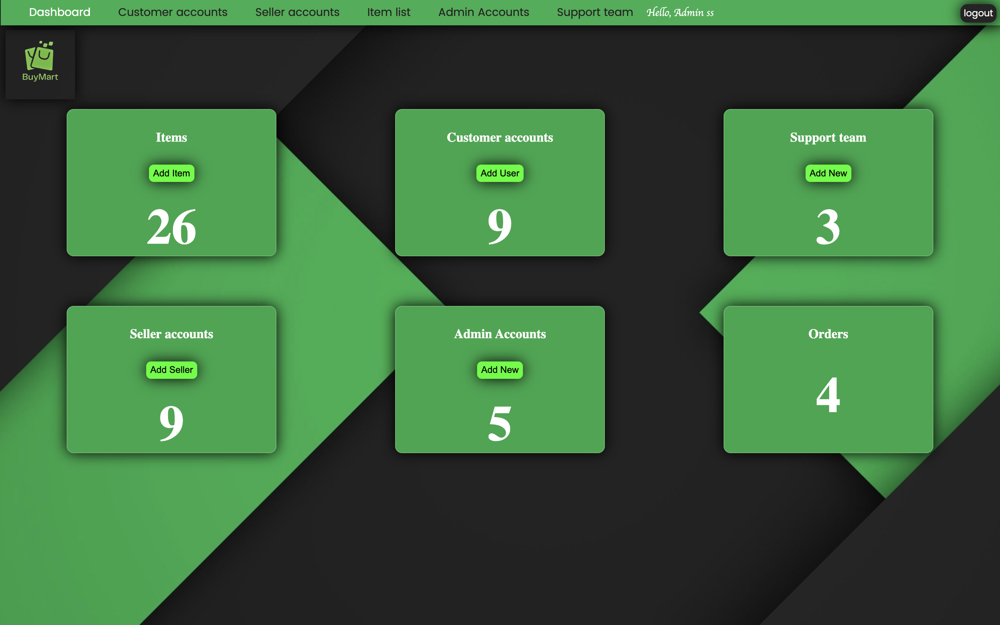

# BuyMart

BuyMart is an E-commerce website created as part of my 1st-year 2nd-semester IWT project at SLIIT. This project showcases my skills in PHP, HTML, SQL, and JavaScript.

## Table of Contents

- [Overview](#overview)
- [Features](#features)
- [Screenshots](#screenshots)
- [Technologies Used](#technologies-used)

## Overview

BuyMart is a user-friendly E-commerce platform that allows users to browse and purchase products. It includes an admin panel for managing products, orders, and users.

## Features

- User registration and authentication
- Product browsing and searching
- Order management
- Admin panel for product, order and user management

## Screenshots

### Homepage

### Admin Page

## Technologies Used

- **Frontend**: HTML, CSS, JavaScript
- **Backend**: PHP
- **Database**: SQL

